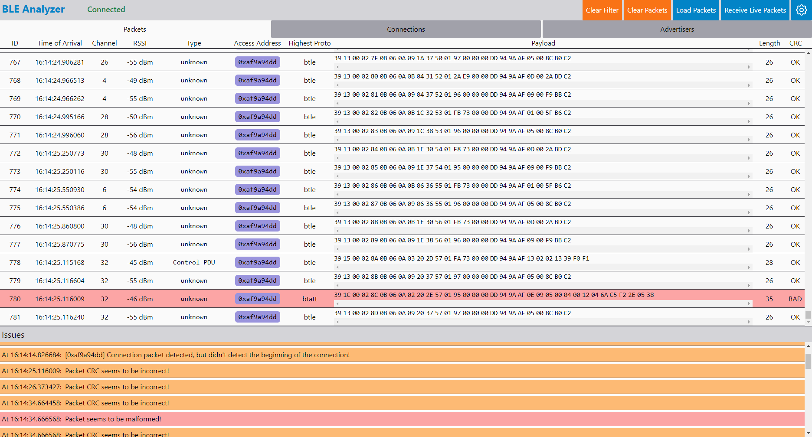

# ble-analyzer-gui

[Live Demo](https://ble-analyzer-gui.netlify.app/)



## Getting Started

Set up [the server](https://github.com/Chaphasilor/ble-analyzer-server), otherwise the GUI can't be used.

```sh-session
$ npm install
$ npm run serve # dev URL will be logged in console (should be http://localhost:8080)
```

### Build for production

```
$ npm run build
```
